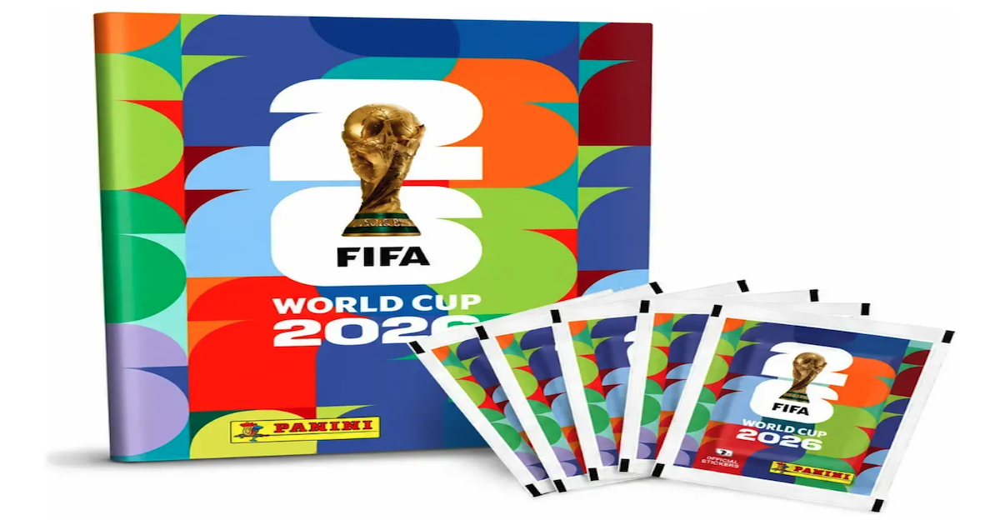

# ⚽ Mi Álbum FIFA — World Cup 2026

> **Find your sticker page in seconds. Track your collection. Never lose a swap again.**

Live at → **https://mialbumfifa.com**

---

## ✨ What is this?

Mi Álbum FIFA is a fast, mobile-first web app for collectors of the **FIFA World Cup 2026 Panini sticker album**.

Search any country instantly, track your collection digitally, manage repeated stickers and quickly check what you already own while swapping with friends or family.

Originally built as a side project during the World Cup sticker season, the app has evolved into a full open-source collector companion focused on speed, simplicity and real-world usability.

---

## 🚀 Features

### 🔍 Smart Search

- Search by:
  - country code (`GER`)
  - country name (`Germany`)
  - album page number

- Real-time filtering with instant results
- Fast UX optimized for live trading sessions

### 🗂️ Digital Album _(requires login)_

- Google login via Supabase Auth
- Track collected stickers
- Mark repeated stickers
- Per-country progress tracking
- Cloud sync across devices

### 🌍 Country Cards

- 48 countries across groups A–L
- Flags, codes, page numbers and progress indicators
- Mobile-friendly layout
- Group-based visual styling

### 💡 Curiosity Carousel

- Fun facts and curiosities for each country
- Localized content (`EN` / `ES`)

### 📱 Mobile-first Experience

- Responsive UI
- Theme support
- Welcome onboarding modal
- Persistent promo banners
- Share menu
- Scroll-to-top shortcuts

### 🌐 Internationalization

- English and Spanish support
- Lightweight custom i18n implementation

---

## ❤️ Open Source

This project started as a small side project for football collectors and families during the FIFA World Cup 2026 sticker season.

Contributions, ideas, bug reports and UX improvements are always welcome 🙌

If you enjoy the project:

- ⭐ Star the repository
- 🐛 Open an issue
- 💡 Suggest new ideas
- 🚀 Share it with fellow collectors

See [`CONTRIBUTING.md`](./CONTRIBUTING.md) for contribution guidelines.

---

## 🛠️ Tech Stack

| Layer         | Tech                                                          |
| ------------- | ------------------------------------------------------------- |
| Frontend      | React 18 + Vite 5                                             |
| Styling       | Vanilla CSS + CSS variables                                   |
| Auth          | Supabase Auth (Google OAuth)                                  |
| Database      | Supabase PostgreSQL + RLS                                     |
| Backend Logic | Supabase Edge Functions (Deno / TypeScript)                   |
| Hosting       | Vercel                                                        |
| Icons / Flags | [`flag-icons`](https://github.com/lipis/flag-icons) by @lipis |

---

## 🧱 Project Structure

```text
src/
├── components/   # Reusable UI components
├── hooks/        # Custom React hooks
├── data/         # Static album + curiosity data
├── styles/       # Design system + modular CSS
├── i18n/         # Translation files
├── lib/          # External clients/config
└── main.jsx
```

Supabase Edge Functions live under:

```text
supabase/functions/
```

---

## 🎨 Design Philosophy

Mi Álbum FIFA is designed to feel:

- fast
- minimal
- mobile-first
- clean
- accessible
- easy to use during real sticker trading sessions

The UI intentionally avoids excessive visual noise and prioritizes usability and clarity.

---

## ⚙️ Local Development

### Prerequisites

- Node.js 18+
- A Supabase project with Google OAuth enabled

### Setup

```bash
git clone https://github.com/studio84dev/mi-album-fifa.git

cd mi-album-fifa

npm install
```

Create a `.env` file:

```env
VITE_SUPABASE_URL=https://your-project.supabase.co
VITE_SUPABASE_ANON_KEY=your-anon-key
```

Run locally:

```bash
npm run dev
```

---

## 📦 Available Scripts

```bash
npm run dev
npm run build
npm run lint
npm run format
```

---

## 🚢 Deployment

Hosted on Vercel.

- `master` → production
- `staging` → preview deployments

Every push automatically triggers a deployment.

---

## 🔒 Security Notes

- Supabase Row-Level Security (RLS) enabled
- Users can only access their own sticker data
- Service role key never exposed to the client
- Authenticated writes validated server-side

---

## 🙌 Credits

- [`flag-icons`](https://github.com/lipis/flag-icons) by @lipis
- [SVG Repo](https://www.svgrepo.com/) — open-licensed SVG icons
- FIFA World Cup sticker collecting community
- Everyone sharing and contributing ideas

---

Developed with ❤️ by Studio84
